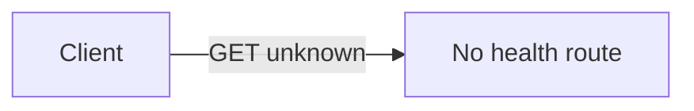

# Health checks for StudentManagement.Api

## Current state

- [`Program.cs`](../src/StudentManagement.Api/Program.cs) registers controllers, Swagger, JWT, and infrastructure, but **no** `AddHealthChecks` / `MapHealthChecks`.
- There is **no** `/health` (or similar) URL to hit today.

## Recommended implementation

1. **Register health checks** in `Program.cs` after other service registration (e.g. after `AddControllers`):
   - `builder.Services.AddHealthChecks()` — baseline “process is up.”
   - **Optional but useful:** add an EF Core database check so “healthy” means the app can reach SQLite:
     - Add NuGet package **`Microsoft.Extensions.Diagnostics.HealthChecks.EntityFrameworkCore`** (version **8.0.x** to match [`StudentManagement.Api.csproj`](../src/StudentManagement.Api/StudentManagement.Api.csproj) and EF **8.0.11**).
     - Chain `.AddDbContextCheck<AppDbContext>()` (type from [`AppDbContext.cs`](../src/StudentManagement.Infrastructure/Persistence/AppDbContext.cs)).
     - Add `using Microsoft.Extensions.Diagnostics.HealthChecks;` and a project reference/usings so `AppDbContext` resolves (API already references Infrastructure).

2. **Map the endpoint** on `app` **before** `app.Run()` (e.g. after `MapControllers()` is fine):
   - `app.MapHealthChecks("/health");`
   - Health endpoints are **anonymous by default** (no JWT), which is what you want for probes and manual checks.

3. **No change to Swagger** is required for health to work; Swagger does not list health by default unless you add a document filter (optional, out of scope unless you want it visible in UI).

## How you will “check” the API after implementation

- Run the API (e.g. `dotnet run` from the Api project folder; note the HTTPS/HTTP URLs in the console).
- **Browser or HTTP client:** `GET https://localhost:{port}/health` (adjust scheme/port to match launch settings).
- **Expected:** HTTP **200** with a small JSON payload when healthy; **503** if a registered check fails (e.g. DB unreachable).

## Files to touch

| File | Change |
|------|--------|
| [`StudentManagement.Api.csproj`](../src/StudentManagement.Api/StudentManagement.Api.csproj) | Add `Microsoft.Extensions.Diagnostics.HealthChecks.EntityFrameworkCore` if using DB check |
| [`Program.cs`](../src/StudentManagement.Api/Program.cs) | `AddHealthChecks` (+ optional `AddDbContextCheck`), `MapHealthChecks("/health")` |

## Optional simplification

If you only need “is Kestrel responding?” and **not** database connectivity, skip the NuGet package and use only `AddHealthChecks()` + `MapHealthChecks("/health")` — fewer dependencies, but less meaningful for a data-backed API.
