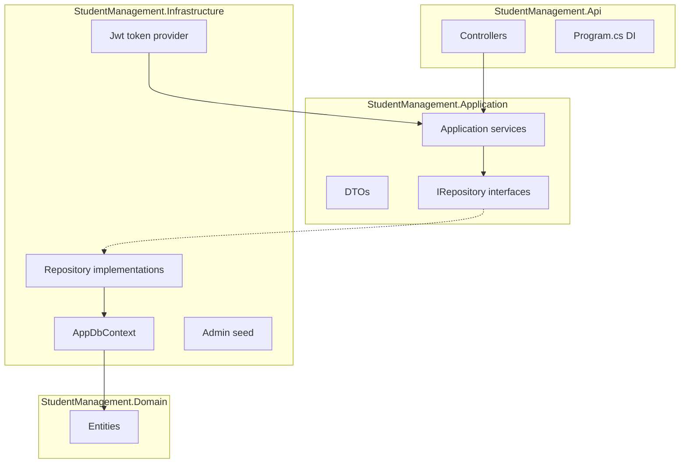

# Student Management API (ASP.NET Core + Clean Architecture)

## Background

The workspace is empty except for Git—this is a **greenfield** implementation. Stack: **ASP.NET Core 8** (LTS), **EF Core** SQLite, **JWT Bearer** auth, **built-in DI** in `Program.cs`.

## High-level architecture

## Solution layout

| Project                            | Responsibility                                                                                                                                                                                                                                                       |
| ---------------------------------- | -------------------------------------------------------------------------------------------------------------------------------------------------------------------------------------------------------------------------------------------------------------------- |
| `StudentManagement.Domain`         | Entities only (no framework dependencies): `Subject`, `Teacher`, `Student`, `AdminUser` (or `User` with role `Admin`).                                                                                                                                               |
| `StudentManagement.Application`    | DTOs (request/response), shared `PagedResult<T>` (or equivalent), service interfaces (`ISubjectService`, `ITeacherService`, `IStudentService`, `IAuthService`), repository interfaces with **paged** list methods where applicable (`ISubjectRepository`, etc.). |
| `StudentManagement.Infrastructure` | `AppDbContext`, EF Core configurations, repository implementations, password hashing (e.g. `IPasswordHasher<T>` from ASP.NET Core or BCrypt), JWT token generation (`IJwtTokenProvider`), `IDbInitializer` to seed admin + SQLite file.                              |
| `StudentManagement.Api`            | Controllers, `Program.cs` (DI registration, JWT middleware, Swagger with Bearer), `appsettings.json` (connection string, JWT key/issuer/audience, **admin username/password for seed only**).                                                                        |

API project references Application + Infrastructure; Application references Domain only; Infrastructure references Application + Domain.

## Data model (SQLite)

- **Subject**: `Id` (Guid or int), `Name` (required, unique index).
- **Teacher**: `Id`, `Name` (consider unique constraint if one teacher name = one record).
- **Student**: `Id`, `Name`, `SubjectId` (FK), `TeacherId` (FK).
- **Admin user**: `Id`, `Username` (unique), `PasswordHash` — only used for login; **no public registration** for admin.

Relationships: Subject 1—* Student, Teacher 1—* Student.

## Authentication

1. **Login (no JWT required)**
  - `POST /api/auth/login`  
  - Body: `{ "username", "password" }`  
  - Validates against seeded `AdminUser` (hashed password).  
  - Returns `{ "token", "expiresIn" }` (or similar) with JWT claims: `sub`/`nameid`, `role` = `Admin` (or a single claim sufficient for authorization).
2. **All other endpoints**
  - `[Authorize]` + JWT Bearer scheme.  
  - Configure `JwtBearerOptions` with same secret/issuer/audience as token generation.
3. **Initial admin**
  - On startup (or first migration), read username/password from configuration (e.g. `[appsettings.json](StudentManagement.Api/appsettings.json)` section `Admin`) and upsert one admin with **hashed** password. **Never** store plaintext passwords in DB; config plaintext is acceptable only for local dev with a note to override via User Secrets / env in production.

## Pagination (all GET list endpoints)

Applies to **GET** `/api/subjects`, **GET** `/api/teachers`, and **GET** `/api/students`.

**Query parameters** (consistent across all three):

- `page` — 1-based page index (default `1`; if invalid, clamp or return `400`).
- `pageSize` — items per page (default e.g. `10` or `20`; enforce a **maximum** cap, e.g. `100`, to avoid abuse).

**Response shape** (shared wrapper, e.g. `PagedResult<T>` in Application):

- `items` — array of DTOs for the current page.
- `totalCount` — total rows matching the query (before paging).
- `page`, `pageSize` — echoed effective values.
- `totalPages` — optional convenience: `ceil(totalCount / pageSize)` (or omit and let clients compute).

**Implementation notes** (Clean Architecture):

- Repository methods return `Task<(IReadOnlyList<T> Items, int TotalCount)>` or a small `PagedResult<T>` from Application, using **EF Core** `Skip`/`Take`/`CountAsync` (or `ToPagedListAsync` pattern) so ordering is **stable** (e.g. by `Id` or `Name`).

## Endpoints (all JSON except login response shape)

| #   | Method | Route             | Auth | Behavior                                                                                                                                                                                                                                      |
| --- | ------ | ----------------- | ---- | --------------------------------------------------------------------------------------------------------------------------------------------------------------------------------------------------------------------------------------------- |
| —   | POST   | `/api/auth/login` | No   | Issue JWT                                                                                                                                                                                                                                     |
| 1   | POST   | `/api/subjects`   | JWT  | Create subject                                                                                                                                                                                                                                |
| 2   | GET    | `/api/subjects`   | JWT  | **Paginated** list (`page`, `pageSize` → `PagedResult<SubjectDto>`)                                                                                                                                                                           |
| 3   | POST   | `/api/teachers`   | JWT  | Create teacher                                                                                                                                                                                                                                |
| 4   | GET    | `/api/teachers`   | JWT  | **Paginated** list (`page`, `pageSize` → `PagedResult<TeacherDto>`)                                                                                                                                                                           |
| 5   | POST   | `/api/students`   | JWT  | Body: student name + **subject identifier** + **teacher name** — resolve `Subject` by name (or by id if you prefer; plan assumes **by name** for subject and teacher as stated) and `Teacher` by name; return 400/404 if duplicate or missing |
| 6   | GET    | `/api/students`   | JWT  | **Paginated** list; include subject/teacher names in each item DTO (same `page` / `pageSize` contract)                                                                                                                                        |

Use consistent API versioning only if you want it later; default is a single `/api/...` group.

**Student registration resolution** (per your requirement): look up **Subject** by name and **Teacher** by name; if either is missing, return `404` with a clear message. Optionally normalize names (trim); document case sensitivity (default: case-insensitive comparison for lookups).

## Dependency injection (registration order in `[Program.cs](StudentManagement.Api/Program.cs)`)

- `AddDbContext<AppDbContext>` with SQLite connection string.
- Register repositories as scoped: `ISubjectRepository` → `SubjectRepository`, etc.
- Register application services as scoped (or transient if stateless).
- `AddAuthentication().AddJwtBearer(...)` and `AddAuthorization()`.
- Call `DbInitializer` or `Migrate()` + seed on startup (dev-friendly).

## NuGet packages (reference)

- API: `Microsoft.AspNetCore.Authentication.JwtBearer`, `Swashbuckle.AspNetCore` (Swagger + “Authorize” for Bearer).
- Infrastructure: `Microsoft.EntityFrameworkCore.Sqlite`, `Microsoft.EntityFrameworkCore.Design` (for migrations).
- Shared: align EF Core versions across projects.

## Migrations and SQLite file

- Connection string example: `Data Source=studentmanagement.db` in project root or `AppContext.BaseDirectory`.
- `dotnet ef migrations add InitialCreate` from API or Infrastructure project with startup project = API.

## Validation and errors

- Use FluentValidation or DataAnnotations on DTOs (minimal: `Required`, `MaxLength`).
- Return 409 Conflict for duplicate subject name (unique index) if applicable.

## Security notes (brief)

- JWT signing key from configuration; minimum length for HMAC-SHA256.
- HTTPS in production; Swagger only in Development if desired.

## Deliverables checklist

- Solution file + four projects wired with project references.
- All seven endpoints above with JWT on six; **GET list** endpoints return **paginated** JSON.
- Seeded admin + SQLite persistence + one EF migration.
- README optional: only add if you explicitly want run instructions—otherwise you can run with `dotnet run` from the API project.
