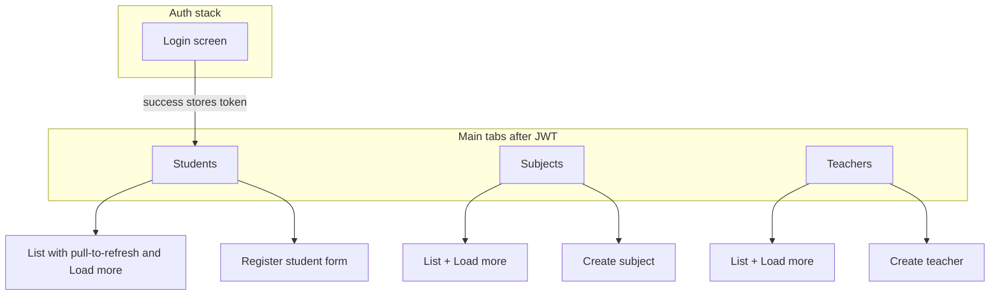

# React Native mobile UI

## Goals

- New **React Native** app at the **repository root** in **`StudentManagementApp/`** (alongside the .NET solution and the **`Context/`** folder with API plans/docs).
- Features: **login** (default fields **username `admin`**, **password `admin`**), **list students** (paginated), **register student** (name + subject name + teacher name), **create subject**, **create teacher** (and list subjects/teachers so the app feels complete and helps pick names when registering students).
- Talk to the existing API: [StudentManagement.Api](../src/StudentManagement.Api/) (`POST /api/auth/login`, JWT on other routes, paginated `GET` for lists).

## Backend alignment (credentials)

The API currently seeds admin from [`appsettings.json`](../src/StudentManagement.Api/appsettings.json) with password **`Admin123!`**. You asked for **`admin` / `admin`** on the login screen.

**Plan:** set `Admin:Password` to **`admin`** in [`appsettings.json`](../src/StudentManagement.Api/appsettings.json) (development only) so the mobile app’s default credentials work end-to-end. Document that production must use a strong password and User Secrets / env vars.

## Tech choices

| Area | Choice | Rationale |
| ---- | ------ | --------- |
| RN toolchain | **Expo** (SDK aligned with current Node LTS), **TypeScript** | Fast scaffold; **run in [Expo Go](https://expo.dev/go)** on a physical device (QR scan) or emulator without a custom native build for MVP |
| Navigation | **React Navigation** — native stack for auth vs app; **bottom tabs** for main areas | Clear separation: Login → Main tabs |
| HTTP | **fetch** or **axios** + small **api client** module | Attach `Authorization: Bearer <token>` after login |
| Token storage | **expo-secure-store** (fallback **AsyncStorage** if needed for web) | JWT not in plain memory-only long term |

## Proposed UI layout (decided)

- **Login:** single screen; **prefilled** username `admin`, password `admin`; primary button **Sign in**; on success navigate to tabs and persist token.
- **Students tab:** list shows `name`, `subjectName`, `teacherName` from `PagedResult` items; **Register** opens modal or stack screen with three fields (`name`, `subjectName`, `teacherName`) matching [CreateStudentRequest](../src/StudentManagement.Application/Dtos/CreateStudentRequest.cs).
- **Subjects tab:** paginated list + **Create** (single field `name`) matching create-subject API.
- **Teachers tab:** paginated list + **Create** (single field `name`) matching create-teacher API.

Visual style: simple, readable (one primary color, consistent padding); use platform-safe components (`SafeAreaView`, `FlatList`).

## Running with Expo Go (development)

- **Install** the **Expo Go** app on your phone ([iOS App Store](https://apps.apple.com/app/expo-go/id982107779) / [Google Play](https://play.google.com/store/apps/details?id=host.exp.exponent)).
- From the app project directory, run **`npx expo start`** (or `npm start`). Use the dev server UI to:
  - **Scan the QR code** with the device camera (iOS) or Expo Go (Android) to open the project in Expo Go.
  - Or press **`i` / `a`** to open in **iOS Simulator** / **Android Emulator** (still uses Expo Go where applicable, or embedded dev client behavior per platform).
- **Networking:** Expo Go on a **physical phone** cannot reach `localhost` on your PC. Set `EXPO_PUBLIC_API_BASE_URL` to your machine’s **LAN IP** (same Wi‑Fi as the phone), e.g. `http://192.168.1.10:5048`, with the ASP.NET API listening on `0.0.0.0` or the LAN interface (document firewall rules). Optionally use **`npx expo start --tunnel`** if LAN routing is awkward (slower; API must still be reachable from the tunnel path or use a deployed API).
- **Constraints:** Stick to libraries supported by the **Expo Go** runtime (managed workflow). The planned stack (fetch, React Navigation, SecureStore) is compatible.

## API integration details

- **Base URL:** configurable via Expo public env (e.g. `EXPO_PUBLIC_API_BASE_URL`). Default examples in README:
  - **Android emulator:** `http://10.0.2.2:5048` (maps to host machine’s localhost if API runs on host port 5048 per [launchSettings.json](../src/StudentManagement.Api/Properties/launchSettings.json)).
  - **iOS simulator:** `http://localhost:5048`.
  - **Physical device:** machine LAN IP, e.g. `http://192.168.x.x:5048` (same Wi‑Fi).
- **Auth:** `POST /api/auth/login` → store `token` → all other calls include header `Authorization: Bearer <token>`.
- **Pagination:** reuse `page`, `pageSize` query params; start with `pageSize` 10–20 and “load more” or infinite scroll on lists.

## Project structure

- `StudentManagementApp/` (repo root) — Expo app root (`app.json`, `package.json`, `tsconfig.json`).
- `src/api/client.ts` — base URL, JSON helpers, 401 handling (clear token → back to login).
- `src/api/endpoints.ts` — typed wrappers for login, subjects, teachers, students.
- `src/screens/` — Login, tab screens, forms.
- `src/navigation/` — linking auth flow and tabs.
- `src/context/AuthContext.tsx` (optional) — token + login/logout.

**Note:** The **`Context/`** folder holds planning docs (e.g. this file); the Expo app lives at **`StudentManagementApp/`**. React **context** (e.g. `AuthContext`) is only the usual React pattern.

## Deliverables

1. Expo TypeScript app scaffold at **`StudentManagementApp/`** (repository root).
2. Implemented screens and API wiring as above; login defaults **admin** / **admin**.
3. Short **README** in the app folder: install dependencies, **Expo Go** on device, `npx expo start` + QR scan, how to set `EXPO_PUBLIC_API_BASE_URL` (LAN IP for real devices; `10.0.2.2` / `localhost` for emulators), and optional `--tunnel`.
4. One-line **backend change**: `Admin:Password` = `admin` in [`appsettings.json`](../src/StudentManagement.Api/appsettings.json) so defaults work.

## Out of scope (unless you ask later)

- Teacher/subject **pickers** fed by live lists (can be phase 2: dropdowns from cached GETs).
- iOS/Android store builds / EAS Submit.
- Offline mode.
